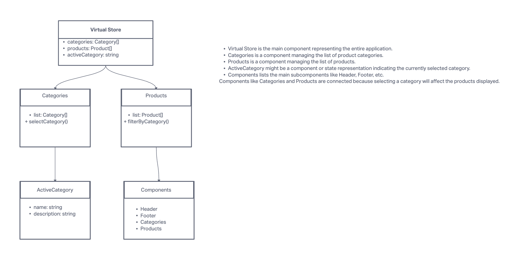

# Virtual Storefront

## LAB - Application State with Redux

This project is the beginning of a multi-phase build process of an e-Commerce storefront, using React and Redux, interfaced with a live API server.

### Getting Started

- Clone the repository and navigate into the project directory.
- Install dependencies with `npm install`.
- Start the development server with `npm run dev`.
- Ensure that `react/prop-types` is set to `['off']` in `.eslintrc.cjs`.

### Phase 1 Requirements

- **Categories List**: Implement a feature to display a list of categories.
- **Products List**: Develop the functionality to show products based on the selected category.
- **User Interface**: Design a user-friendly and clean interface.

### Redux Store Construction

- **Categories**: State includes a list of categories and the active category.
- **Products**: State includes a list of products, each associated with a category.

## Phase 2: LAB - Redux - Combined Reducers

We are enhancing our storefront application by incorporating a shopping cart feature.

### Phase 2 Requirements

#### User Stories

- As a user, I want to choose products from the list and add them to my shopping cart.
- As a user, I want to see the products I've added to my shopping cart on the side of the page.
- As a user, I want to change the quantity of items I intend to purchase in the header (e.g., CART (1)).
- As a user, I want to remove an item from my shopping cart.

#### Application Flow

- User selects a category and is presented with a list of products.
- User can add a product to their cart by clicking an "Add to Cart" button.
- The cart's contents are displayed in a `<SimpleCart />` component on the side of the page.
- User can remove items from the cart, updating the cart total in the header.

#### Home Page Operation

- Upon category selection, display products associated with that category, available in stock.
- Each product should have an "add to cart" button.
- On "add to cart" button click, add the item to the cart and update the `<SimpleCart />` and header cart indicator.

#### Redux Store Enhancement

- **Categories Reducer**: Manage a list of categories and the active category.
- **Products Reducer**: Handle a list of products, including actions for filtering by category and reducing stock quantities.
- **Cart Reducer**: Manage an array of products added to the cart, with actions to add or remove items.

## Phase 3: LAB - Redux - Asynchronous Actions (Thunk)

In phase 3, we will be connecting our Virtual Store to a live API so that our data is persistent and able to be separately managed.

### Phase 3 Requirements

The user stories from Phases 1 and 2 remain unchanged. For this phase, we are now adding the following new user stories to meet the new requirements.

- As a user, I want to interact with live inventory so that I have confidence that the displayed products are in stock.
- As a user, I want to know that when I add an item to my cart, that it is removed from inventory so that no other users can purchase it.
